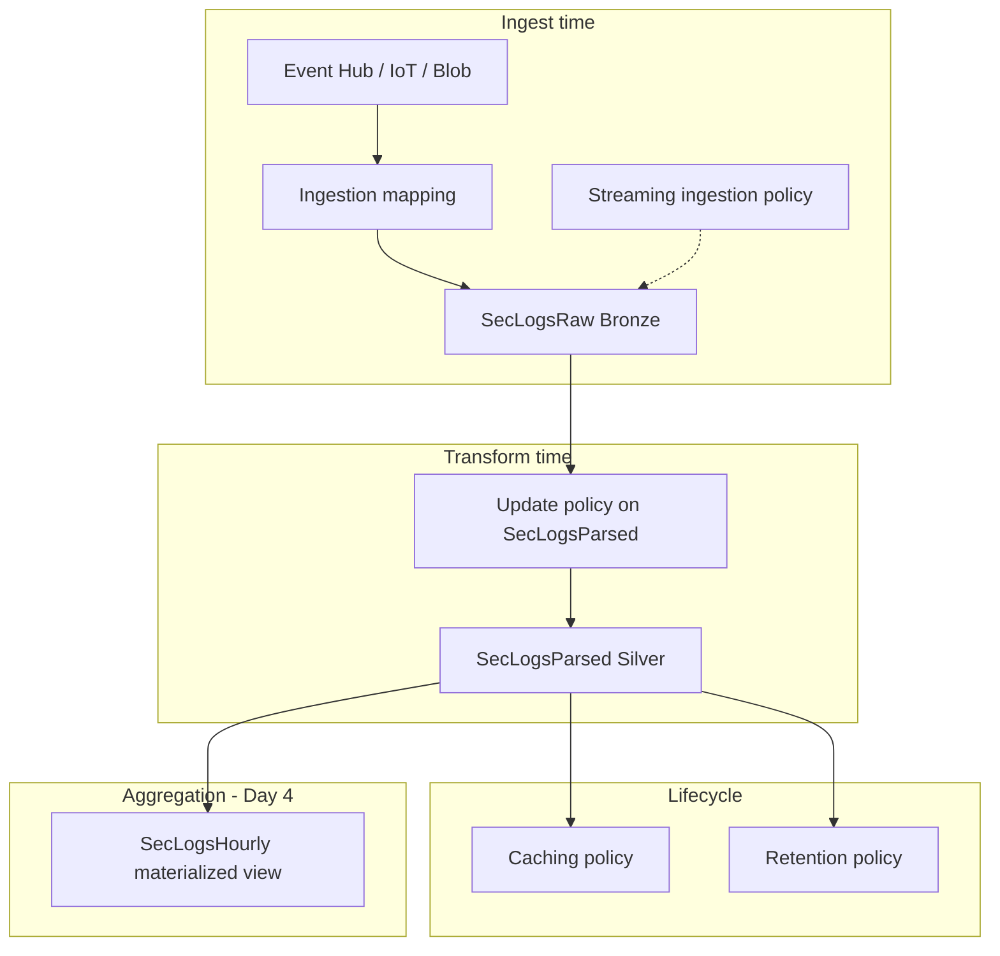

# ADX policies — reference for Labs 4–5

Tables used in this module: `SecLogsRaw` (Bronze), `SecLogsParsed` (Silver), `SecLogsHourly` (Gold).

**Labs:** [labs.md](labs.md) | **Queries:** [queries/](queries/)

Read this before **Day 3 Labs 4–5** if update policies are new to you.

---

## How to use this document

| If you want to… | Read section |
|-----------------|--------------|
| Understand what a policy is | [1](#1-overview) – [3](#3-what-is-a-policy-in-adx) |
| See every policy type ADX supports | [6](#6-all-policy-types-overview) |
| Learn the policy you use in **Lab 5** (Bronze → Silver) | [7](#7-update-policy-deep-dive-bronze--silver) |
| Learn streaming policy from **Lab 2–3** | [8](#8-streaming-ingestion-policy-deep-dive) |
| Prepare for **Day 4** retention & caching | [9](#9-retention-policy-deep-dive) – [10](#10-caching-policy-deep-dive) |
| Answer “why is Silver empty?” / “why didn’t policy run?” | [12](#12-common-questions-faq) – [13](#13-troubleshooting) |

Microsoft reference hub: [Table policies management](https://learn.microsoft.com/en-us/azure/data-explorer/kusto/management/policies).

---

# 1. Overview

In traditional data warehouses you often build **ETL pipelines** outside the database:

```text
  Source ──► Azure Data Factory / Spark job ──► transform ──► load target table
```

In ADX, many of those rules are stored **inside the database** as **policies** — saved instructions that tell ADX *what to do automatically* when data arrives or ages.

**Analogy:**  
Think of a policy like **rules on a mailbox**:

| Real world | ADX equivalent |
|------------|----------------|
| “When mail arrives, sort it into folders” | **Update policy** — new Bronze row triggers Silver transform |
| “Deliver express mail to the front desk immediately” | **Streaming ingestion policy** — low-latency ingest path |
| “Shred mail older than 7 years” | **Retention policy** — delete data after N days |
| “Keep this week’s mail on your desk, rest in archive” | **Caching policy** — hot vs cold storage on cluster |

You do **not** run the policy yourself each time. ADX enforces it when the triggering event happens (ingest, time passing, etc.).

---

# 2. Policies vs mappings vs connections — do not confuse them

These concepts solve **different** problems:

| Concept | What it is | When you configure it | Course example |
|---------|------------|----------------------|----------------|
| **Ingestion mapping** | Field-level map from file/JSON → table columns | Before `.ingest` or data connection | `SecLogsRaw_JsonMapping` (Day 2 Lab 4); CSV mapping on **`SecLogsCsvStg`** (Day 2 Lab 5) |
| **Data connection** | Continuous link from Event Hub / IoT Hub → table | Day 3 Labs 2–3 | Event Hub → `SecLogsRaw` |
| **Policy** | Automatic rule attached to database or table | After table exists | Update policy on `SecLogsParsed` |
| **Manual KQL command** | You run it once | Any time | `.set-or-append` backfill (Lab 5) |

```text
  MAPPING        = "how to parse incoming bytes into columns"
  CONNECTION     = "where continuous messages come from"
  POLICY         = "what ADX should do automatically afterward"
  BACKFILL CMD   = "one-time catch-up for data that arrived before the policy"
```

**Note:** *“Is update policy the same as a mapping?”*  
**No.** Mapping runs **during ingest** into the **source** table. Update policy runs **after ingest** into the **source** table and writes to a **different** table.

---

# 3. What is a policy in ADX?

A **policy** is a **named, persisted configuration object** attached to:

- a **database**, or  
- a **table**, or  
- a **materialized view**

It defines automatic behavior — for example:

- “When a row lands in `SecLogsRaw`, transform it and append to `SecLogsParsed`.”
- “Keep data for 365 days, then allow deletion.”
- “Use the fast streaming ingest path for this table.”

Policies are managed with **control commands** (management KQL), not with the Azure Portal alone — though some policies can also be set in Portal **Policies** blades.

---

# 4. Why does ADX use policies?

| Benefit | Explanation |
|---------|-------------|
| **Co-location** | Transform logic lives next to the data — no separate orchestration service required for Bronze → Silver. |
| **Consistency** | Every ingest path (batch JSON, CSV, Event Hub, IoT) triggers the **same** Silver transform. |
| **Lower latency** | Streaming + update policy can land typed Silver rows within seconds of Bronze arrival. |
| **Operational simplicity** | One KQL query in the policy; version and test like any other query. |
| **Governance** | Retention and caching policies enforce lifecycle rules per table. |

**Trade-off to know:** A **bad** update policy query can **block ingestion** into the source table. That is why Microsoft recommends testing the transform as a normal query first (`SecLogsRaw | take 10 | extend ...`).

---

# 5. How policies work — core mechanics

## 5.1 Who sets policies?

| Actor | Typical scope |
|-------|---------------|
| **You (labs)** | Table policies in **your** database (`LogsDB_u01`, etc.) |
| **Cluster admin** | Cluster-level streaming capability, shared storage |
| **Governance team** | Retention on production databases |

In this course, you alter policies in **your database only** — you do not affect other databases on the shared cluster.

## 5.2 How do you view and change policies?

**View** (safe, read-only):

```kql
.show table SecLogsParsed policy update
.show table SecLogsRaw policy streamingingestion
.show table SecLogsParsed policy retention
.show database policy retention
```

**Change** (requires appropriate permissions):

```kql
.alter table SecLogsParsed policy update @'[ ... JSON ... ]'
.alter table SecLogsRaw policy streamingingestion enable
.alter table SecLogsParsed policy retention @'...'
```

**Disable** (example):

```kql
.alter table SecLogsParsed policy update @'[{"IsEnabled":false,"Source":"SecLogsRaw","Query":"..."}]'
```

Pattern: **`.alter`** to create or replace, **`.show`** to inspect.

## 5.3 When does a policy run?

Depends on policy type:

| Policy type | Trigger |
|-------------|---------|
| **Update** | New data **ingested** into the **source** table (after policy exists) |
| **Streaming ingestion** | Affects **how** hub/stream data is ingested (engine path) |
| **Retention** | Background — data age vs configured duration |
| **Caching** | Background — extent age vs hot cache window |
| **Merge** | Background — when extent count/size thresholds met |

**Critical rule for update policy:** It does **not** retroactively process rows that were already in the source table **before** the policy was enabled. That is why Lab 5 has a **backfill** step.

## 5.4 Database policy vs table policy

Many policies can be set at **database** level (default for all tables) and **overridden** at **table** level.

```text
  Database policy (default)
        │
        ├── Table A  (inherits)
        ├── Table B  (override — table wins)
        └── Table C  (inherits)
```

Example: database retention 365 days; `SecLogsHourly` table retention 730 days for longer Gold history.

## 5.5 Policy JSON — what does `@'[...]'` mean?

Management commands often pass policy details as a **JSON array** in a string literal:

```kql
.alter table SecLogsParsed policy update @'[{"IsEnabled":true,"Source":"SecLogsRaw","Query":"..."}]'
```

| Piece | Meaning |
|-------|---------|
| `@'...'` | Kusto **string literal** (quotes inside do not break the command) |
| `[{ ... }]` | JSON array — update policy allows multiple source/query pairs in advanced scenarios |
| `\"` inside Query | Escaped quotes inside the embedded KQL string |

**Tip:** In the Web UI, paste the **entire** `.alter ... policy update` line as **one command**. Do not split across lines — the embedded Query must stay intact.

---

# 6. All policy types — overview

ADX has several policy types. This course **hands on** the bold ones; others are **awareness** for interviews and production design.

| Policy | Attached to | Purpose | This course |
|--------|-------------|---------|-------------|
| **Update** | Table | Auto-transform source table → target table | **Day 3 Lab 5** |
| **Streaming ingestion** | Table / Database | Enable low-latency streaming ingest path | **Day 3** (`00-enable-streaming-ingest.kql`) |
| **Retention** | Database / Table / MV | Minimum time to keep data before deletion eligible | **Day 4** (show only) |
| **Caching** | Table / MV | How long data stays in **hot cache** | **Day 4** (show only) |
| **Merge** | Table | Automatic extent compaction | Awareness |
| **Ingestion batching** | Table | Batch small ingests for efficiency | Awareness |
| **Partitioning** | Table | Partition key for scale-out queries | Awareness |
| **Row Level Security** | Table | Filter rows per principal | **Day 5** |
| **Export** | Table | Continuous export to storage | Awareness |
| **Extents tags retention** | Table | Retain data matching extent tags | Awareness |



---

# 7. Update policy — deep dive (Bronze → Silver)

This is the **most important policy** in Day 3.

## 7.1 What is it?

An **update policy** on table **T** says:

> “Whenever new data is ingested into **source table S**, run **query Q** and **append** the results to **T**.”

In our course:

- **Source (S):** `SecLogsRaw` (Bronze)  
- **Target (T):** `SecLogsParsed` (Silver)  
- **Query (Q):** Parse `RawPayload` dynamic → typed columns + `SourceSystem`

## 7.2 Why do we need it?

Bronze stores a **blob** of each event in `RawPayload` (dynamic). Analysts want:

```kql
SecLogsParsed | where SourceIP == "10.20.1.44" and EventType == "AuthFailure"
```

Without update policy you would either:

- Parse `RawPayload` on **every query** (slow, error-prone), or  
- Run a **scheduled ETL job** outside ADX.

Update policy parses **once at ingest time** and keeps Silver ready for investigation and Gold aggregates.

## 7.3 How does it work? Step by step

```text
  STEP 1  Event arrives (batch .ingest OR Event Hub connection)
            │
            v
  STEP 2  Row written to SecLogsRaw (Bronze)
            │
            v
  STEP 3  ADX checks: does any table have update policy with Source=SecLogsRaw?
            │
            v  yes, IsEnabled=true
  STEP 4  Policy Query runs on the NEW extent(s)
            │
            v
  STEP 5  Output rows APPENDED to SecLogsParsed (Silver)
```

**Important:** The policy is defined **on the target** (`SecLogsParsed`), not on Bronze.

## 7.4 The policy object — field by field

From [queries/05-update-policy-backfill.kql](queries/05-update-policy-backfill.kql):

| JSON field | Lab value | What it means |
|------------|-----------|---------------|
| `IsEnabled` | `true` | Policy is active. `false` = disabled but definition kept. |
| `Source` | `SecLogsRaw` | Which table triggers this policy. |
| `Query` | KQL transform (§7.5) | Must output columns matching `SecLogsParsed` **exactly**. |
| `IsTransactional` | `false` | If `true`, source ingest fails if policy fails. `false` = more forgiving in labs. |
| `PropagateIngestionProperties` | `false` | Whether ingestion metadata flows to target. Not needed here. |

Inspect after enabling:

```kql
.show table SecLogsParsed policy update
```

Expected: `IsEnabled: true`, `Source: SecLogsRaw`, non-empty `Query`.

## 7.5 The transform query — explained line by line

This is the **same** KQL in the policy and in the backfill command:

```kql
SecLogsRaw
| extend Timestamp = coalesce(todatetime(RawPayload.Timestamp), IngestionTime)
| extend EventType = tostring(RawPayload.EventType)
| extend SourceIP = tostring(RawPayload.SourceIP)
| extend DestinationHost = tostring(RawPayload.DestinationHost)
| extend UserPrincipal = tostring(RawPayload.UserPrincipal)
| extend Severity = tostring(RawPayload.Severity)
| extend Message = tostring(RawPayload.Message)
| extend Facility = tostring(RawPayload.Facility)
| extend SourceSystem = case(
    RecordFormat == "JSON", "Batch-JSON",
    RecordFormat == "CSV", "Batch-CSV",
    RecordFormat == "EventHub", "EventHub",
    RecordFormat == "IoT", "IoT-Hub",
    "Unknown")
| project Timestamp, EventType, SourceIP, DestinationHost, UserPrincipal,
          Severity, Message, Facility, SourceSystem
```

| Line | Why |
|------|-----|
| `coalesce(todatetime(RawPayload.Timestamp), IngestionTime)` | Use event time; if missing, fall back to ingest time. |
| `tostring(RawPayload.*)` | Extract fields from **dynamic** JSON/CSV-packed payload. |
| `case(RecordFormat == ...)` | Map Bronze format label → human `SourceSystem` lineage. |
| `project ...` | **Required** — column names, types, and order must match `SecLogsParsed` schema. |

**Test before enabling policy:**

```kql
SecLogsRaw | take 5
| extend Timestamp = coalesce(todatetime(RawPayload.Timestamp), IngestionTime)
| extend EventType = tostring(RawPayload.EventType)
// ... rest of transform
| project Timestamp, EventType, SourceIP, DestinationHost, UserPrincipal,
          Severity, Message, Facility, SourceSystem
```

If this returns errors or nulls everywhere, fix the query **before** `.alter policy update`.

## 7.6 SourceSystem — why it exists

`SourceSystem` is **not** in the raw event. The policy **derives** it:

| Bronze `RecordFormat` | Silver `SourceSystem` | Rows (locked) |
|----------------------|----------------------|---------------|
| `JSON` | `Batch-JSON` | 1500 |
| `CSV` | `Batch-CSV` | 1000 |
| `EventHub` | `EventHub` | 500 |
| `IoT` | `IoT-Hub` | 500 |

One update policy handles **all four ingest paths** — batch and streaming.

## 7.7 Backfill — why Lab 5 has two steps

| Step | Command | Purpose |
|------|---------|---------|
| **1** | `.alter table SecLogsParsed policy update ...` | Forward **new** Bronze rows automatically |
| **2** | `.set-or-append SecLogsParsed <| SecLogsRaw \| extend ...` | Copy **existing** 3500 Bronze rows into Silver |

```text
  Timeline
  --------

  Day 2 batch ingest ──► 2500 rows in Bronze  (no policy yet)
  Day 3 streaming    ──► 3500 rows in Bronze  (still no policy)
  Lab 5 Step 1       ──► policy enabled
  Lab 5 Step 2       ──► backfill → Silver = 3500
  After Lab 5        ──► new Bronze rows auto-forward to Silver
```

**Doubt:** *“I enabled policy but Silver count is 0.”*  
You skipped **backfill**. Run Step 2.

**Doubt:** *“I ran backfill but new events don’t appear in Silver.”*  
You skipped **Step 1** or `IsEnabled` is `false`.

## 7.8 Chains and multiple hops

Update policies can chain: **A → B → C** if B has source A and C has source B.  

Our course uses one hop: **Bronze → Silver**. Day 4 **Gold** uses a **materialized view** (different mechanism — aggregated, not row-for-row).

## 7.9 Production cautions

| Risk | Mitigation |
|------|------------|
| Policy query error blocks Bronze ingest | Test with `take 10`; use `IsTransactional: false` initially |
| Schema drift | Alter target table + policy together |
| Duplicate Silver rows | Backfill twice without dedup logic duplicates data — run backfill **once** |
| Heavy transform | Keep policy query efficient; filter early if possible |

Microsoft docs: [Update policy overview](https://learn.microsoft.com/en-us/kusto/management/update-policy?view=microsoft-fabric) | [Tutorial](https://learn.microsoft.com/en-us/kusto/management/update-policy-tutorial?view=microsoft-fabric)

---

# 8. Streaming ingestion policy — deep dive

## 8.1 What is it?

A **streaming ingestion policy** tells ADX: *this table may use the **streaming ingest engine*** for supported sources (Event Hub, IoT Hub, etc.) — targeting **lower latency** than the default queued path.

It does **not** create the Event Hub connection. It only **permits** the fast path.

## 8.2 Why do we need it?

| Without streaming policy | With streaming policy |
|------------------------|----------------------|
| Hub messages may use **queued** ingestion | Eligible for **streaming** engine (seconds latency) |
| Still continuous, but slower micro-batching | Better for live SOC dashboards |

For utility cyber: live **AuthFailure** streams from VPN or substation sensors benefit from seconds-level landing in Bronze.

## 8.3 How does it work?

**Two levels** (both must be considered):

```text
  CLUSTER level          STREAMING CAPABILITY enabled on training cluster
        │
        v
  DATABASE or TABLE level   .alter table SecLogsRaw policy streamingingestion enable
        │
        v
  DATA CONNECTION           Event Hub / IoT Hub → SecLogsRaw
```

Lab command ([queries/00-enable-streaming-ingest.kql](queries/00-enable-streaming-ingest.kql)):

```kql
.alter table SecLogsRaw policy streamingingestion enable

.show table SecLogsRaw policy streamingingestion
```

Verify: `IsEnabled: true` (or equivalent enabled state in `.show` output).

## 8.4 Streaming policy vs update policy

| | Streaming ingestion policy | Update policy |
|--|---------------------------|---------------|
| **On which table** | Usually **Bronze** (`SecLogsRaw`) | **Silver** (`SecLogsParsed`) |
| **Purpose** | Faster **landing** in Bronze | **Transform** Bronze → Silver |
| **When** | During hub ingest | After source table ingest |

You need **both** in a low-latency pipeline: fast Bronze landing + automatic Silver parse.

## 8.5 Common questions

**Q: Does streaming policy replace `.ingest` from Blob?**  
No. Batch `.ingest` from Blob uses the queued path. Streaming policy mainly affects **hub** connections.

**Q: Table has only update policy as destination — need streaming policy?**  
Microsoft notes: tables that receive data **only** via update policy may not need their own streaming policy. Our `SecLogsParsed` is fed by policy from Bronze, not directly from hubs.

**Q: High volume — always use streaming?**  
Above roughly **4 GB/hour per table**, review [streaming ingestion limits](https://learn.microsoft.com/en-us/azure/data-explorer/ingest-data-streaming) — queued may be more appropriate.

---

# 9. Retention policy — deep dive

*Covered in theory Day 4; Lab 7 shows policies read-only.*

## 9.1 What is it?

**Retention policy** defines the **minimum time ADX keeps data** before it becomes eligible for **deletion**.

## 9.2 Why?

- **Compliance** — NERC CIP, GDPR, utility audit windows  
- **Cost** — old telemetry does not grow storage forever  
- **Different tables, different rules** — raw Bronze shorter, Gold aggregates longer

## 9.3 How?

```kql
.show database policy retention
.show table SecLogsParsed policy retention
```

Example alter ( **do not run on the shared training cluster** unless directed in class ):

```kql
.alter table SecLogsParsed policy retention softdelete = 365d
```

Soft delete means data is recoverable for a period before permanent purge (see current Microsoft docs for exact semantics in your cluster version).

## 9.4 Utility pattern

| Table | Typical retention thinking |
|-------|---------------------------|
| `SecLogsRaw` | Shorter — large dynamic payloads |
| `SecLogsParsed` | Longer — investigation facts |
| `SecLogsHourly` | Long — small aggregated history for trends |

Database default applies to all tables unless a **table policy overrides**.

---

# 10. Caching policy — deep dive

## 10.1 What is it?

ADX stores data in **extents** (compressed chunks) on storage. **Caching policy** controls how long extents stay in the cluster’s **hot cache** (SSD) for fast queries.

## 10.2 Why?

| Tier | Speed | Cost |
|------|-------|------|
| **Hot cache** | Milliseconds–seconds | Uses cluster SSD |
| **Cold** (still queryable) | Slower | Cheaper blob storage |

At **lab scale** (3500 rows), everything feels hot. At **TB scale**, caching tuning matters for dashboard performance and cost.

## 10.3 How?

```kql
.show table SecLogsParsed policy caching
```

Example shape (awareness only):

```kql
.alter table SecLogsParsed policy caching hot = 7d
```

Frequently queried Silver and Gold tables → longer hot window. Archive tables → shorter hot window.

## 10.4 Retention vs caching — do not confuse

| | Retention | Caching |
|--|-----------|---------|
| **Question answered** | *When is data **deleted**?* | *How long is data **fast to query**?* |
| **Data still exists?** | After retention expires → eligible for delete | After cache window → still on disk, slower |

---

# 11. Other policies — awareness for interviews

## 11.1 Merge policy

Automatically **merges small extents** into larger ones for query efficiency. Runs in background when thresholds met. Large fact tables in production almost always have merge policies tuned.

## 11.2 Ingestion batching policy

Batches many small ingests into fewer larger extents — reduces extent explosion from tiny files. Relevant when thousands of small blob drops arrive per hour.

## 11.3 Partitioning policy

Defines a **partition key** (often time-based) to improve query pruning at scale. Not required at lab row counts.

## 11.4 Row Level Security (RLS) policy

**Day 5** — restricts which rows a principal sees:

```kql
.alter table RlsDemoEvents policy row_level_security ...
```

Different from update policy: RLS filters **reads**, not ingest transforms.

## 11.5 Export policy

Continuously exports ingested data to external storage (e.g. compliance archive). Awareness only in this course.

## 11.6 Materialized views — related but not a “table policy”

`SecLogsHourly` (Day 4) is a **materialized view** — ADX maintains aggregates automatically. Conceptually similar to update policy (automatic transformation) but optimized for **aggregations**, not 1:1 row mapping.

| Mechanism | Row relationship | Course use |
|-----------|------------------|------------|
| Update policy | 1 Bronze row → 1 Silver row | `SecLogsParsed` |
| Materialized view | Many Silver rows → fewer Gold rows | `SecLogsHourly` |

---

# 12. Common questions (FAQ)

**Q:** *“Does update policy read from `SecLogsCsvStg`?”*  
**A:** No. Day 2 promotes CSV into **`SecLogsRaw.RawPayload`** first. The update policy source is always **`SecLogsRaw`**.

### “Where do I attach the update policy — Bronze or Silver?”

**Silver** (`SecLogsParsed`). The policy says: source = `SecLogsRaw`.

### “Does policy run on historical data when I create it?”

**No.** Only **new** ingests after enable. Use **backfill** for existing rows.

### “Can I have two source tables for one Silver table?”

One policy entry = one `Source`. Multiple sources need multiple policy entries or union logic in a single source table design.

### “What if my policy query returns extra columns?”

Ingest/policy fails or misbehaves. Output must match target schema **exactly**.

### “Policy vs scheduled .set-or-append job?”

| Update policy | Scheduled job |
|---------------|---------------|
| Automatic on every ingest | Runs on your schedule |
| Millisecond–second latency | Minutes–hours latency |
| Built into ADX | External orchestration |

### “Who wins — database or table policy?”

**Table override** wins over database default for most policy types.

### “Can I see policy execution errors?”

Check `.show ingestion failures`, `.show operations`, and query failures in monitoring. Broken update policies often surface as **ingest failures** on the **source** table.

### “Is update policy ETL?”

Conceptually yes (transform + load). Mechanically it is **native ADX automation**, not ADF/Spark — though you can combine both in enterprise architectures.

---

# 13. Troubleshooting

| Symptom | Likely cause | Fix |
|---------|--------------|-----|
| `SecLogsParsed` count = 0 | No backfill | Run Lab 5 Step 2 |
| Silver stuck at 2500 after streaming | Policy added after stream but backfill before stream | Re-run backfill after all Bronze data present |
| New hub events not in Silver | Policy disabled or query error | `.show table SecLogsParsed policy update` |
| Bronze ingest fails after policy enabled | Bad policy query with `IsTransactional: true` | Test query; set `IsTransactional: false` while debugging |
| `SourceSystem` all `Unknown` | `RecordFormat` not set in Bronze mapping | Fix ingestion mapping on hub connections |
| Streaming still slow | Cluster streaming off or table policy disabled | Re-run `00-enable-streaming-ingest.kql` and confirm streaming is enabled on the cluster |
| Duplicate Silver rows | Backfill run twice | Avoid re-running `.set-or-append` without clearing Silver |

**Diagnostic queries:**

```kql
// Bronze health
SecLogsRaw | summarize count() by RecordFormat

// Silver health
SecLogsParsed | summarize count() by SourceSystem

// Policy state
.show table SecLogsParsed policy update
.show table SecLogsRaw policy streamingingestion
```

---

# 14. Map policies to course labs

| Day | Lab | Policy / mechanism | Query file |
|-----|-----|-------------------|------------|
| 3 | Before 2–3 | Streaming ingestion enable | `00-enable-streaming-ingest.kql` |
| 3 | 5 | Update policy + backfill | `05-update-policy-backfill.kql` |
| 4 | 7 | Show retention & caching | `07-gold-materialized-view.kql` (Q5) |
| 5 | RLS | Row level security | Day 5 queries |

**Locked checkpoints after Lab 5:**

| Table | Count |
|-------|-------|
| `SecLogsRaw` | **3500** |
| `SecLogsParsed` | **3500** |
| AuthFailure in Silver | **700** |
| Distinct `SourceSystem` | **4** |

---

# 15. Glossary

| Term | Meaning |
|------|---------|
| **Policy** | Saved automatic rule on database/table/MV |
| **Source table** | Table whose ingest triggers update policy |
| **Target table** | Table that receives policy query output |
| **Backfill** | One-time manual copy of existing source rows to target |
| **Extent** | Compressed storage chunk of table data |
| **Hot cache** | SSD-resident extents for fast queries |
| **Streaming engine** | Low-latency ingest path for hubs |
| **Queued ingestion** | Default batch-oriented ingest path |
| **Dynamic column** | `dynamic` type — JSON blob (`RawPayload`) |
| **RLS** | Row Level Security — read-time filtering |

---

# 16. Quick reference — commands cheat sheet

```kql
// UPDATE POLICY
.alter table SecLogsParsed policy update @'[{"IsEnabled":true,"Source":"SecLogsRaw","Query":"..."}]'
.show table SecLogsParsed policy update

// STREAMING INGESTION
.alter table SecLogsRaw policy streamingingestion enable
.show table SecLogsRaw policy streamingingestion

// RETENTION (show in labs)
.show database policy retention
.show table SecLogsParsed policy retention

// CACHING (show in labs)
.show table SecLogsParsed policy caching

// BACKFILL (not a policy — one-time command)
.set-or-append SecLogsParsed <| SecLogsRaw | extend ... | project ...
```

---

**Next steps:** Read [README.md](README.md) Section 6, then complete [labs.md](labs.md) Labs 4–5. Test your transform as a normal query before enabling the policy.
